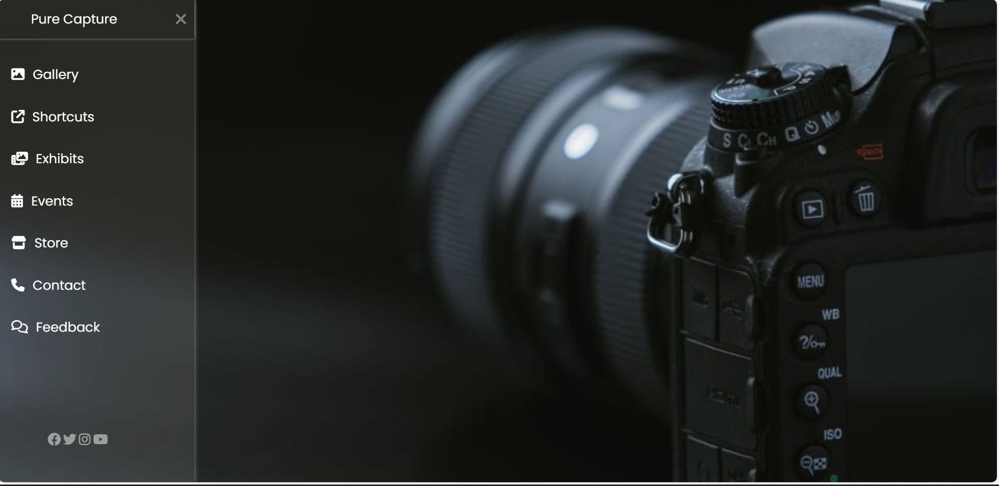

# pure_capture
# Pure Capture - Sidebar Navigation Menu 🌟

This project is a stylish and responsive **sidebar navigation menu** using **HTML**, **CSS**, and **Font Awesome Icons**. It features a smooth sliding sidebar with hover effects, social media links, and a visually appealing background image. The UI design is ideal for photography or creative portfolio websites.

---

## 🔥 Features

- 📸 Background image section (`photoc.png`)
- 📂 Slide-in/slide-out sidebar menu
- 🎨 Stylish hover animations and transitions
- ✅ Responsive layout
- 💻 Clean and modern UI
- 📱 Social media icon links
- 🧠 Pure HTML & CSS 

---

## 🖼️ Preview

 

---

## 🛠️ Tech Stack

- HTML5
- CSS3
- Google Fonts – *Poppins*
- Font Awesome 6

---
🙋‍♂️ Developed By-
Rohit Shinde

🌐 GitHub Profile:-[github](https://github.com/rohitshinde-tech)

